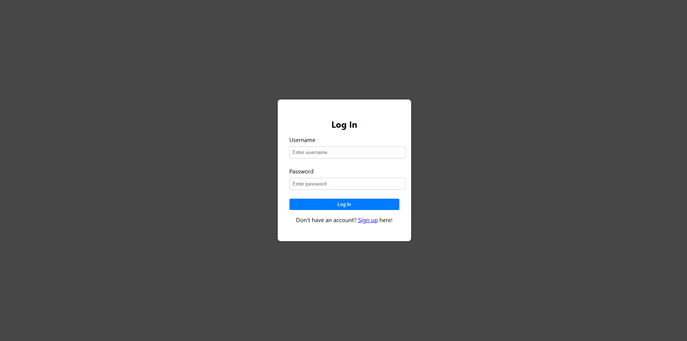
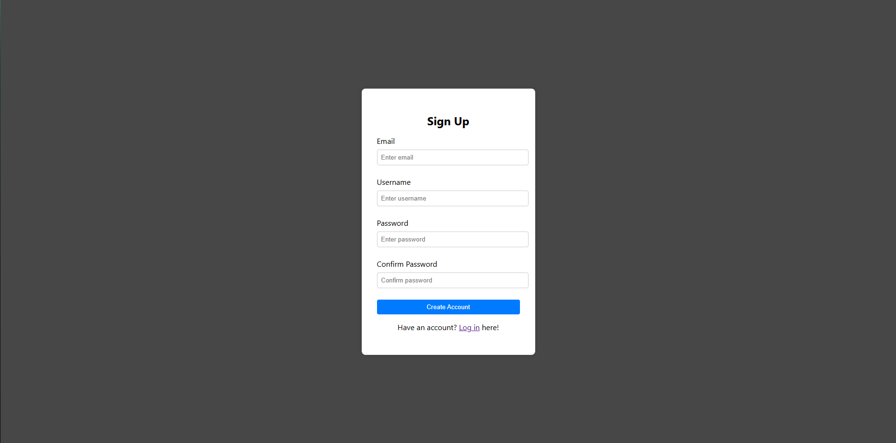
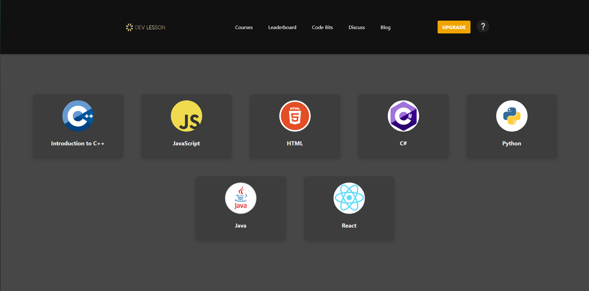
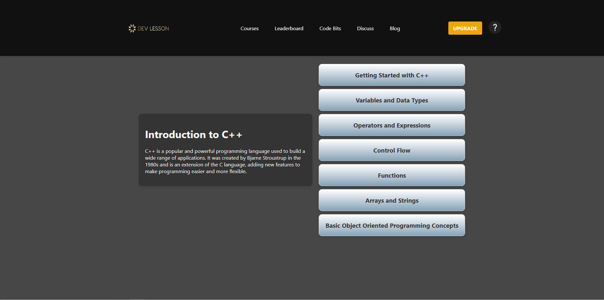

DevLesson is a Web Application that is used to help people learn programming languages and concepts.

Here is the login page:

and the sign up page:

and finally the dashboard:

If you go into the C++ course this is what you will see:

